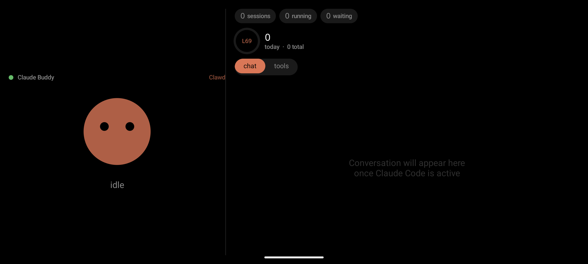

# Claude Code Buddy

An Android app that turns any Android device into a **hardware companion for Claude Code CLI** — a live ambient display and approval interface for your AI coding sessions, communicating entirely over Bluetooth LE.



---

## What it does

- **Live session state** — sessions running, waiting, token count, current level, all updating in real time
- **Tool call approvals** — every Bash command pops an approval card. Tap **Approve** or **Deny** from across the room
- **Live conversation** — follow the chat between you and Claude as it happens
- **Tool history** — recent tool calls with timestamps
- **Animated buddy** — expressive character that reacts to session state (sleeping, working, waiting, celebrating a level-up)
- **Portrait + landscape** — responsive layout with a chat/tools panel toggle
- **Multiple sessions** — tracks all active Claude Code sessions simultaneously, tagged by session ID

---

## Architecture

```
Claude Code CLI ←→ bridge/buddy_daemon.py ←→  BLE  ←→ Android app
    hooks             Unix socket                        GATT server
```

**Two components:**

**1. Android app** — runs as a foreground service, advertises as a BLE peripheral (Nordic UART Service + custom DECISION characteristic), renders live state with Jetpack Compose on a true-black OLED theme.

**2. Bridge daemon** — Python process that hooks into Claude Code CLI, connects to the Android as a BLE central, relays session snapshots and routes approval decisions back.

### BLE protocol

| UUID | Direction | Purpose |
|------|-----------|---------|
| `6e400002-...` NUS RX | daemon → device | JSON snapshots (state, chat, tokens, prompt) |
| `6e400003-...` NUS TX | device → daemon | Notifications (best-effort) |
| `6e400004-...` DECISION | daemon reads | Approval decisions polled every 500ms |

The DECISION characteristic is the key reliability mechanism: instead of BLE notifications (which require CCCD subscriptions that can become stale after reconnects), the daemon polls via **GATT READ** every 500ms. This is reliable on any BLE central — Linux/BlueZ, ESP32, nRF52840, macOS, Windows.

---

## Hardware

Designed for **Android gaming tablets** (RedMagic Nova/Astra, Razer Edge) but works on any Android 8+ device with BLE peripheral support. The large OLED screens, big batteries, and strong haptics make them ideal desk companions.

---

## Setup

### Android app

```bash
./gradlew assembleDebug
adb install app/build/outputs/apk/debug/app-debug.apk
```

Grant Bluetooth permissions when prompted. The app advertises as `Claude0000` (name starts with `Claude` so the desktop picker can find it).

### Bridge daemon

Requires Python 3.9+ and [`bleak`](https://github.com/hbldh/bleak) (auto-installed on first run).

```bash
# Linux / macOS
./bridge/start-buddy.sh

# macOS (double-click in Finder)
open bridge/start-buddy.command

# Windows PowerShell
./bridge/start-buddy.ps1

# Windows Command Prompt
bridge\start-buddy.bat
```

### Claude Code hooks

The hooks are configured in `~/.claude/settings.json`. Add them once:

```json
{
  "hooks": {
    "UserPromptSubmit": [{ "hooks": [{ "type": "command", "command": "python3 /path/to/bridge/buddy_hook.py", "timeout": 5 }] }],
    "SessionStart":    [{ "hooks": [{ "type": "command", "command": "python3 /path/to/bridge/buddy_hook.py", "timeout": 5 }] }],
    "PreToolUse": [{
      "matcher": "Bash",
      "hooks": [{ "type": "command", "command": "python3 /path/to/bridge/buddy_hook.py", "timeout": 130, "statusMessage": "⏳ Waiting for Hardware Buddy approval…" }]
    }],
    "PostToolUse": [{ "hooks": [{ "type": "command", "command": "python3 /path/to/bridge/buddy_hook.py", "timeout": 5 }] }],
    "Stop":        [{ "hooks": [{ "type": "command", "command": "python3 /path/to/bridge/buddy_hook.py", "timeout": 5 }] }]
  }
}
```

> **Note:** Only `Bash` commands require tablet approval. All other tools (Read, Write, Edit, Agent) pass through automatically.

---

## Usage

1. `./bridge/start-buddy.sh`
2. Open Claude Code in your terminal
3. The display updates live as you work
4. When Claude Code wants to run a shell command, the approval card appears — tap **Approve** or **Deny**

### Daemon output

```
12:49:13  ◌  Scanning for Claude Buddy…
12:49:15  ●  Found Claude0000  (46:CF:86:62:9D:F0)
12:49:17  ●  Connected — heartbeats every 10 s
12:49:41  →  Session A3F2 — generating response
12:49:43  ⏳  Bash  git push origin main
12:49:45  ✔  Bash  [✔1 ✘0]
12:49:46  ◆  Claude: Pushed to origin/main.
```

---

## Display states

| State | Trigger | Character |
|-------|---------|-----------|
| **sleep** | Disconnected / idle 30s+ | Eyes closed, slow breathing |
| **idle** | Connected, nothing active | Gentle blink and sway |
| **busy** | Claude is generating | Quicker bob, shimmer |
| **attention** | Session waiting for input | Alert, amber glow |
| **approval** | Bash command pending decision | Approval card overlay, pulsing ring |
| **celebrate** | Level up (every 50K tokens) | Bounce + level badge |

---

## Compatibility with Claude Desktop

The app speaks the standard **Nordic UART Service** protocol used by the official Claude Hardware Buddy. Enable Developer Mode in Claude Code desktop (`Help → Troubleshooting → Enable Developer Mode`) and open `Developer → Open Hardware Buddy…` — no Python daemon needed.

---

## Other boards

The polling approach works with any BLE central. An ESP32 or nRF52840 running matching firmware can replace the Python daemon entirely — the protocol is the same NUS + DECISION characteristic.

---

## Roadmap

- [ ] Bonding / encrypted link (M5)
- [ ] Haptic patterns for approval / deny / level-up
- [ ] Physical button mapping (Approve/Deny via hardware buttons)
- [ ] Multi-device dashboard via LAN/Tailscale WebSocket

---

## License

MIT
